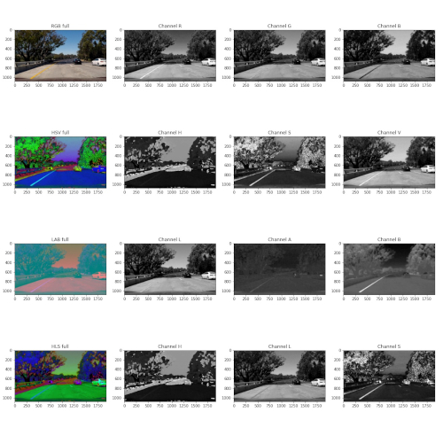
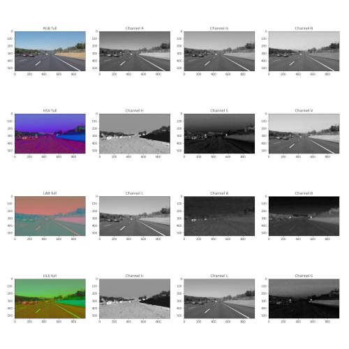
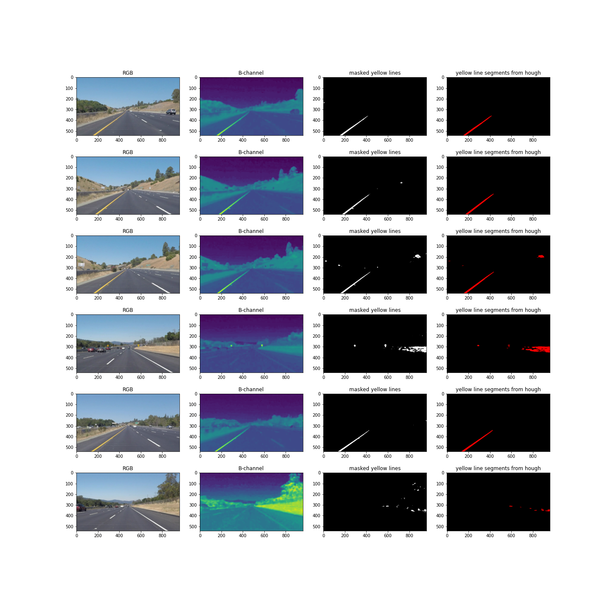
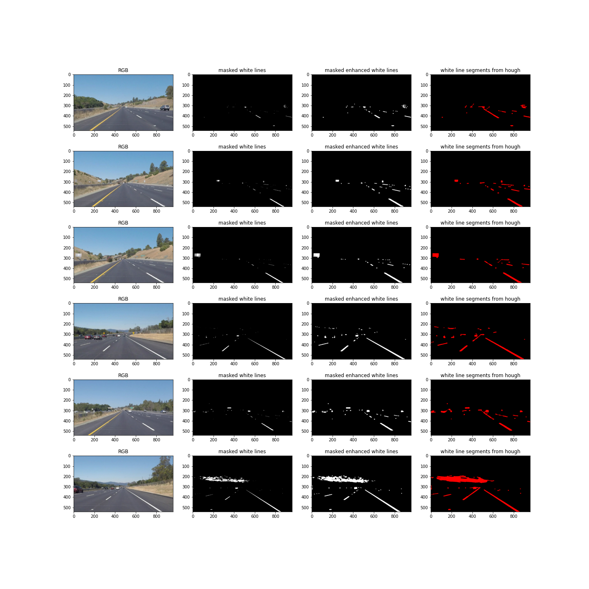
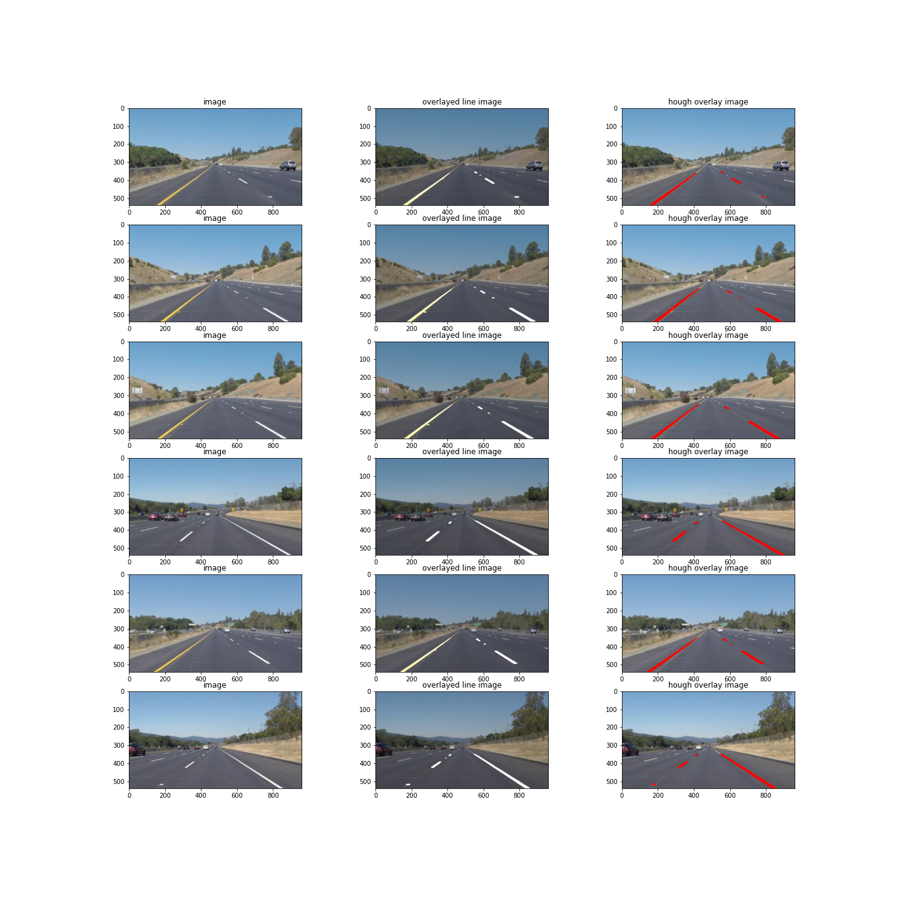
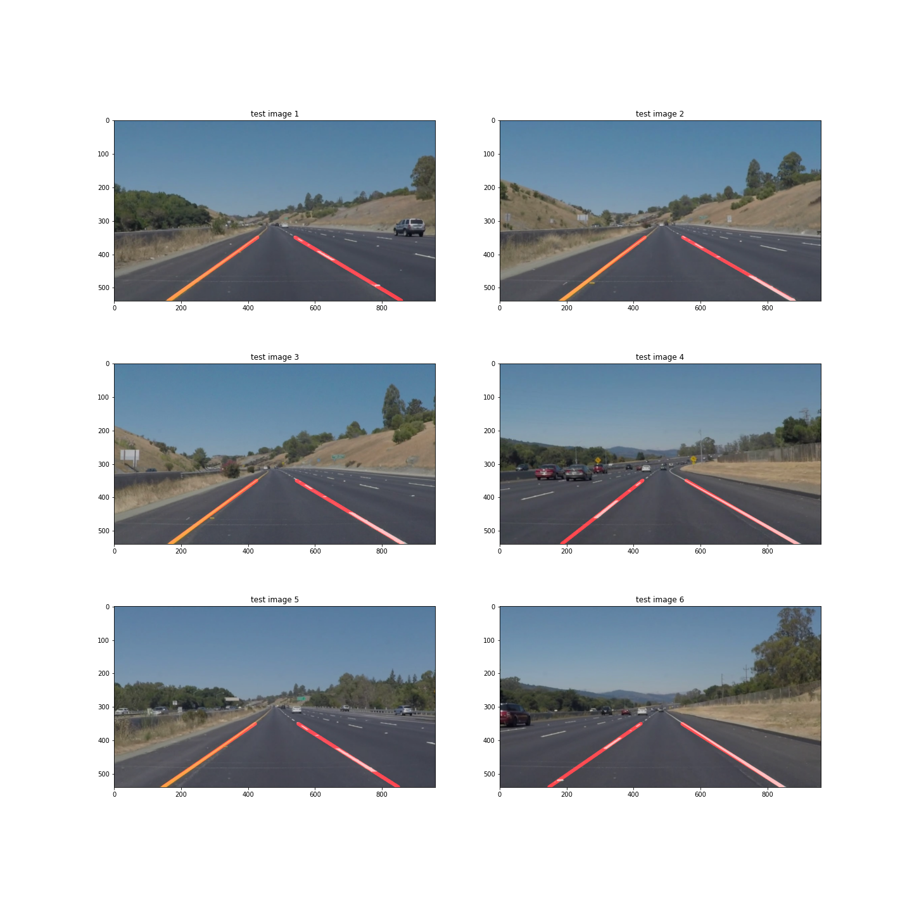

# **Finding Lane Lines on the Road** 

## Project 1 Description and Outcomes

### In this project, a simple lane line finding frame was implemented. The framework can successfully detect lane lines for different scenerios in which there are solid yellow or white lines on one side while the other side has white broken lane lines. In some cases, the detection problem may be challenging depending on the light conditions, car speed, or the lane curvature, etc. 

---

**Finding Lane Lines on the Road**  
&nbsp;
The goals / steps of this project are the following:
* Make a pipeline that finds lane lines on the road, and
* Reflect on what is implemented.

[//]: # (Image References)

[image1]: ./examples/challengev2.jpg "Grayscale"

---
### **Reflection**
&nbsp;
To implement the framework overall, a simple pipeline is used. Initially, the images in RGB space are converted into gray scale and blurred by a Gaussian kernel convolution. After that, Canny edge detection with different lower and higher threshold values is applied. These edges are makes out from the images and Hough transformation is used to extract line segments from edges by setting different values and tuning the parameters such as rho, theta, threshold, min_line_len, and max_line_gap. We noticed that it is very hard to filter out some outliers to draw single lane lines for each side with this intial version. 

&nbsp;
After all trials and errors, we decided to take another approach and considered to detect different lane colors separately. We analyzed images in different color spaces and observed how each channels look like in different color spaces and picked the suitable ones for our lane colors. This improved the performance of the framework abundantly. The following is the piplelined description.

#### **1. Pipeline Description**
&nbsp;
Here, we describe the pipeline implentation. As mentioned previously, we start with observing images in different color spaces. We decided to use LAB space to detect yellow lines and HLS to detect white lines. Next, we converted imags to those color spaces to detect lines accordingly as shown in Fig. 1. In order to do that, we used cv2.inRange() function as suggested. 

    <!--
 -->
         
        
    <!--
 -->
    
<em>Fig 1 (a) An image taken from challenge video  (b) solidWhiteCurve in different colors paces, RGB, HSV, LAB, and, HLS respectively. Note that B-channel of LAB color spaces distunguishes the yelow solid lane line in (a) whereas white colors in HLS space become shiny green.</em>

&nbsp;
We noticed that we can further improve the performance especially for the broken white line by using a series of cv2.dilate() and cv2.erode() functions. So, instead of cv2.Canny(), we used Hough transformation on these images. See the Fig. 2 below for color detection in images and created Hough line segments on the new images. 

    <!--
 -->
         
        
    <!--
 -->
    
<em>Fig 2 (a) Yellow colored pixels, i.e. line segments, are extracted by cv2.inRange() and  cv2.HoughLinesP() on the images in LAB color space. (b) White line segments, are extracted by cv2.inRange() and  cv2.HoughLinesP() on the enhanced images in HLS color space.</em>

&nbsp;
Next, we combined the separate color, i.e. line, detections together and filtered out the rest of detected color pixels by creating masks in a specified trapezoidal region by cv2.fillPoly() and cv2.bitwise_and(). These results are shown in Fig.3 with overlayed images. 

    <!--
 -->
         
    <!--
 -->
    
<em>Fig 3 Extracted line segments are combined and corresponding Hough line segments are overlayed on the original image. </em>

&nbsp;
Finally, we draw solid lane line on both sides using the Hough line segments. Here, we defined an additional draw_solid_lines() function to do that. First, for given line segments we evaluated the slope and divided checked if the slope values are greater that a threshold to ignore horizontal lane lines in the images. Then, we set a vertical divider for left and right side additional to the slope angle. Because, there may still be a line with same slope on the left line but located on the right side of the image. Separating the line segments, we interpolate/ fit the points on the line segments separately for left and right side and then, extrapolate to get end points of the single solid lines. Fine results are provided in the test_images_output directory but also in Fig. 4 below. 

    <!--
 -->
         
    <!--
 -->
    
<em>Fig 4 Final results on given test images. </em>

&nbsp;
See the psedocode below for overall pipeline. 

> **for** image **do:**  
> &nbsp;&nbsp;&nbsp;&nbsp;ConvertColorSpace(image, 'LAB') **and** ConvertColorSpace(image, 'HLS')  
> &nbsp;&nbsp;&nbsp;&nbsp;ColorInRange(image, low_threshold, high_threshold)  
> &nbsp;&nbsp;&nbsp;&nbsp;**if** 'HLS' **:**  
> &nbsp;&nbsp;&nbsp;&nbsp;&nbsp;&nbsp;&nbsp;&nbsp;Enhance(image, kernel, iteration)&nbsp;&nbsp;&nbsp;&nbsp;&nbsp;&nbsp; *&larr; dilation and erosion on white pixels*    
> &nbsp;&nbsp;&nbsp;&nbsp;CombineLines(yellow_lines, white_lines)  
> &nbsp;&nbsp;&nbsp;&nbsp;HoughLines(rho, theta, threshold, min_line_len, max_line_gap)  
> &nbsp;&nbsp;&nbsp;&nbsp;DrawSolidLines(image, hough_lines, color, thickness)

&nbsp;
The pipeline is also tested on three different videos including the challenge video. Below is the resulting test videos with lane lines detected successfully.

    
    

#### **2. Identify potential shortcomings with your current pipeline**

There are a couple of drawbacks of the pipeline implented for this project.
* Firstly, lane lines are assumed to be straight.
* Additionally, each image is studied in two different color spaces for yellow and white lines separately and then they are combined before hough lines. In other words, the framework assumes that it is always day time and lane lines are always either yellow or white or the combination.
* We didn't study how the performance is affected when the lanle lines are occluded by other cars in traffic or shadows and darkness by the environment.
* Another drawback is that the camera is assumed to be in the middle of lanes lines in the image frame and the lane shift of car is not considered in this project.
* Last but not least, tuning parameters in hough lines transformation and cv2.inRange() require some trial and error. 

#### **3. Suggest possible improvements to your pipeline**

> "It is not always possible to be the best, but it is always possible to improve your own performance."  
>> &nbsp;&nbsp;&nbsp;&nbsp;&nbsp;&nbsp;&nbsp;&nbsp;&nbsp;&nbsp;&nbsp;&nbsp;&nbsp;&nbsp;&nbsp;&nbsp;&nbsp;&nbsp;&nbsp;&nbsp;&nbsp;&nbsp;&nbsp;&nbsp;&nbsp;&nbsp;&nbsp;&nbsp;&nbsp;&nbsp;&nbsp;&nbsp;&nbsp;&nbsp;&nbsp;&nbsp;&nbsp;&nbsp;&nbsp;&nbsp;&nbsp;&nbsp;&nbsp;&nbsp;&nbsp;&nbsp;&nbsp;&nbsp;&nbsp;&nbsp;&nbsp;&nbsp;&nbsp;&nbsp;&nbsp;&nbsp;&nbsp;&nbsp;&nbsp;&nbsp;&nbsp;&nbsp;&nbsp;&nbsp;&nbsp;&nbsp;&nbsp;&nbsp;&nbsp;&nbsp;&nbsp;&nbsp;&nbsp;&nbsp;&nbsp;&nbsp;&nbsp;&nbsp;&nbsp;&nbsp;&nbsp;&nbsp;&nbsp;&nbsp;&nbsp;&nbsp;&nbsp;&nbsp;&nbsp;&nbsp;&nbsp;&nbsp;&nbsp;&nbsp;&nbsp;&nbsp;&nbsp;&nbsp;&nbsp;&nbsp;&nbsp;&nbsp;&nbsp;&nbsp;&nbsp;&nbsp;&nbsp;&nbsp;&nbsp;&nbsp;&nbsp;&nbsp;&nbsp;&nbsp;&nbsp;&nbsp;&nbsp;&nbsp;&nbsp;&nbsp;&nbsp;&nbsp;&nbsp;&nbsp;&nbsp;&nbsp;&nbsp;&nbsp;&nbsp;&nbsp;&nbsp;&nbsp;&nbsp;&nbsp;&nbsp;&nbsp;&nbsp;&nbsp;&nbsp;&nbsp;&nbsp;&nbsp;&nbsp;&nbsp;&nbsp;&nbsp;&nbsp;&nbsp;&nbsp;&nbsp;&nbsp;&nbsp;&nbsp;&nbsp;&nbsp;
*J.Stewart*

Having said that,
* a curvature analysis and fitting detected lane pixels into curves would give us more precise detection, especially for the lanes further away from the camera. 
* Furthermore, different color spaces may be studied in more detailed so that a single color space may be able to detect different colors of lanes with different thresholds. 
* Broken white lane lines will look different in images depending on the vehicle speed and the camera fps. So, this may be used as a parameter in lane detection.  
